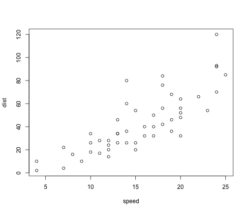

<html>

<head>

<title>Cinema and Clouds</title>
</head>

<body>

<h1> Introduction </h1>

 Although data science projects often employ large amounts of numeric data, some projects examine patterns within text and require a different set of tools. In this code-through tutorial, we are going to explore several packages in R that enable researchers to analyze qualitative data sets and discover cool patterns. We are also going to create two word clouds based on movie plot summaries.

In order to complete this tutorial, you will need access to R or RStudio. If you are not familiar with either of these software or would like a refresher on the basics, check out the first steps of my previous code-through <a href="https://castower.github.io/2020-02-29-waffles/" target="_blank">here</a>. I walk you through the entire set-up process beginning with the software.

If you're all set to go with R and RStudio, then proceed below:  

# Set-Up

## Library of Packages

[Google](https://www.google.com/)

Before we begin analyzing and our data and creating word clouds, first, we need to load a few packages into our 'library'. Specifically we need the following packages:

<pre class="knitr r">summary(cars)
</pre>

<pre class="knitr r">##      speed           dist       
##  Min.   : 4.0   Min.   :  2.00  
##  1st Qu.:12.0   1st Qu.: 26.00  
##  Median :15.0   Median : 36.00  
##  Mean   :15.4   Mean   : 42.98  
##  3rd Qu.:19.0   3rd Qu.: 56.00  
##  Max.   :25.0   Max.   :120.00
</pre>

You can also embed plots, for example:

<pre class="knitr r">plot(cars)
</pre>

<pre class="knitr r">plot(cars)
</pre>

</body>
</html>
